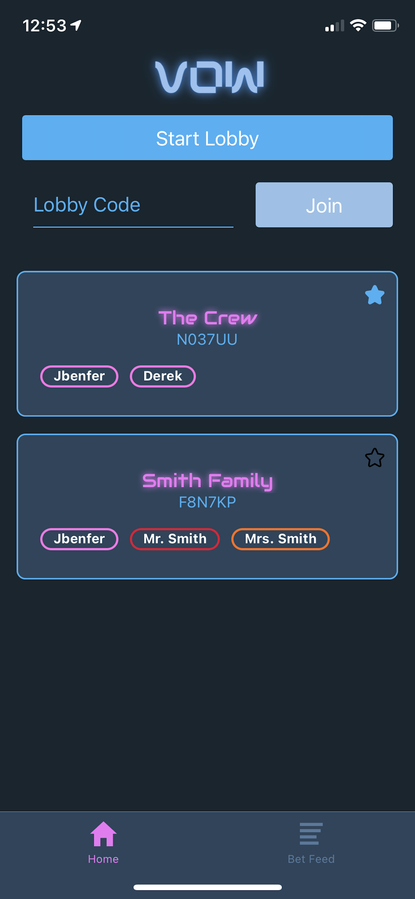
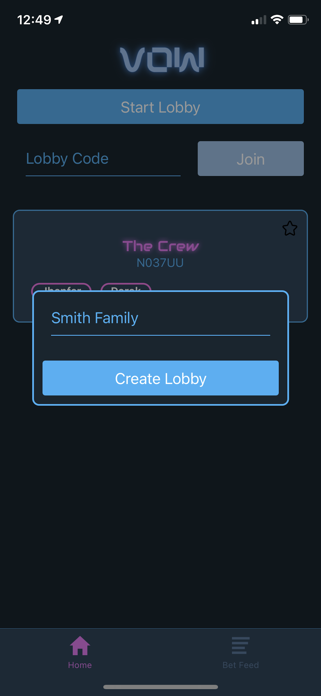
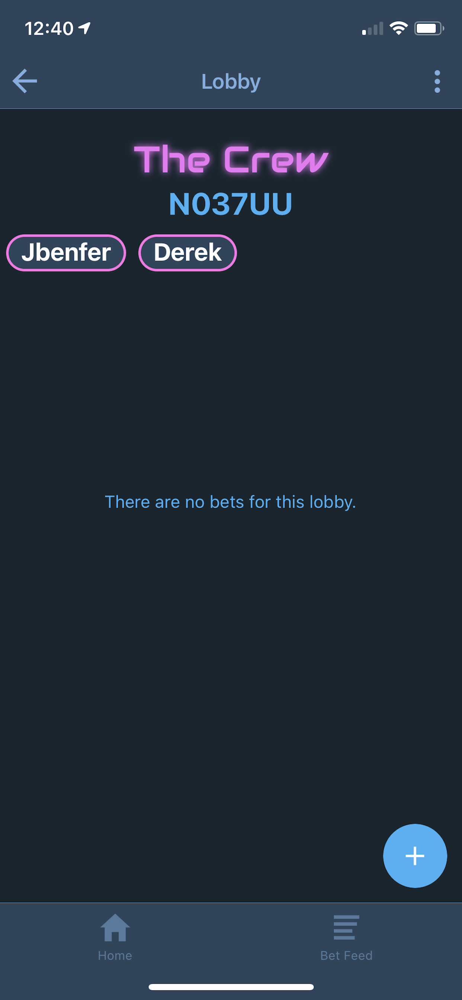
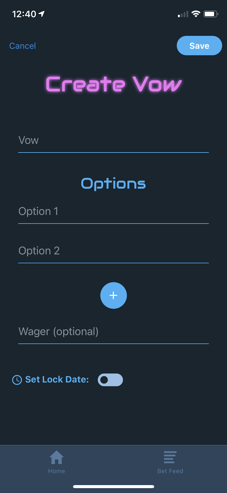
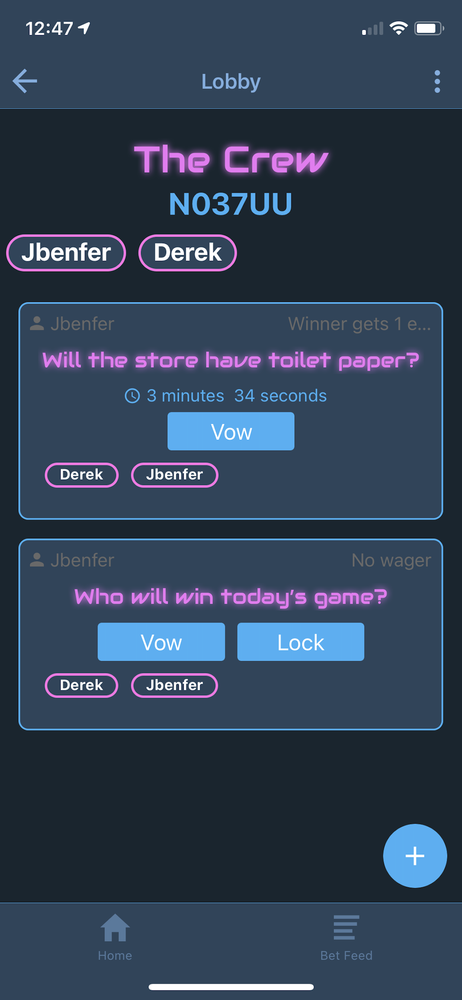
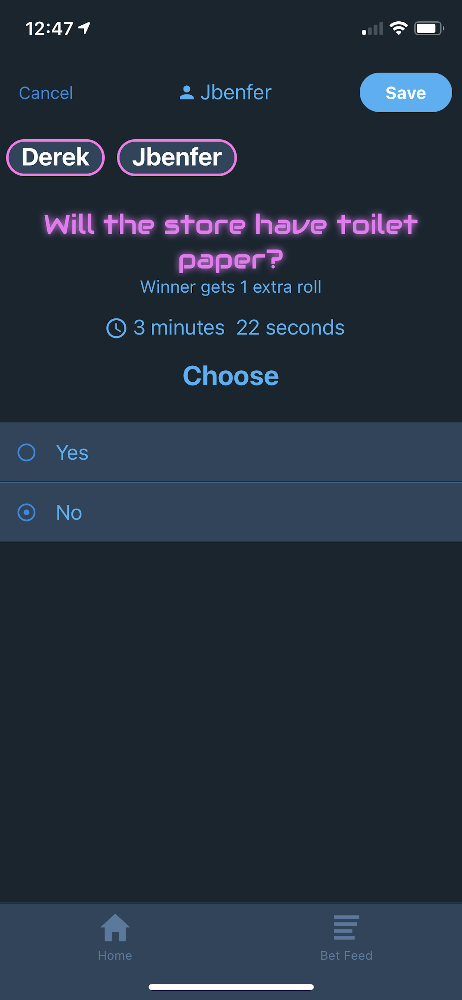
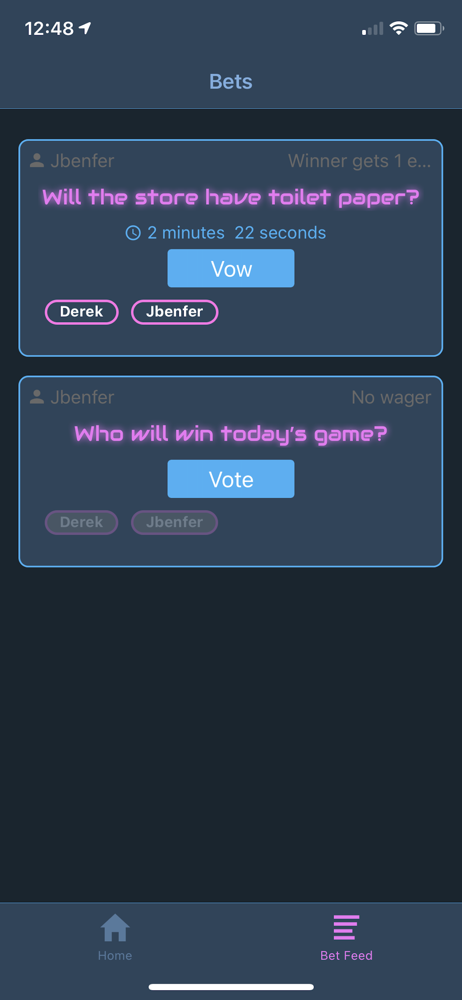

# Vow
### Developed by John Benfer and Derek Jergensen

Vow is an Android and iOS app for friendly bets, wagers, trivia, etc. using open-ended "Vows". Users can create or join a lobby where they can create and participate in Vows. 

The tech stack for Vow is a React Native frontend with Expo and a Firebase Realtime Database. 

*The components code is not the most clean or meant for production

## Primary Features:
  - Sign up with username
  - Create lobby
  - Join existing lobby with code
  - Favorite a lobby
  - Create a Vow with a prompt, options, wager, and expiration date/time
  - Vow on existing Vows by selecting an option
  - Vote on the correct option once the Vow has ended
  - See what users got a Vow right or wrong
  - View Vows in Vow Feed tab

# Screenshots

## Home screen

  

## Create Lobby

  

## Empty Lobby

  

## Create Vow

  

## Lobby With Two Vows

  

## Vow Options

  

## Vow Feed

  

